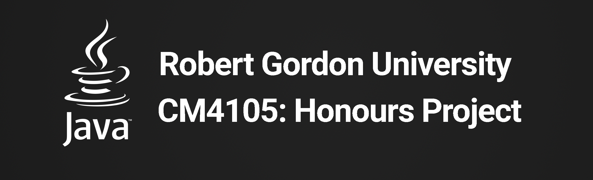

## CM4105 Honours Project - Darie-Dragos Mitoiu

The CM4105 Honours Project is a Bundle of Machine Learning Experiments written in Python and Java Samples with the
ultimate goal of allowing the creation of a JavaFX Desktop Application that uses the machine learning experiments
to provide accurate predictions related to computer systems failure.
The Application supports Algorithms such as the Support Vector Machines, Random Forest Model, 
Logistic Regression Model and the Multi-Layer Perceptron Model.

## CM4105 Honours Project Compile-time Dependencies

* [Python](http://www.python.org) (2.7 required)
* [Java](http://www.java.com) (1.8 required)
* [sklearn](https://scikit-learn.org) (required)
* [pandas](https://pandas.pydata.org) (required)
* [matplotlib](https://www.matplotlib.org/) (required)
* [CX_Freeze](https://cx-freeze.readthedocs.io/en/stable) (optional)
* [Git](https://git-scm.com) (optional)

## Installation

The [CM4105 Honours Project installation guides] includes instructions for installing the project as part of a local application.

## Running CM4105 Honours Project

### Run-time options:

* `python <path/to/main.py>` - Path to entry point file. If unspecified, the current working directory is used.

### Research: Forecasting Computer Systems Failure
### Technique: Support Vector Machines (SVMs) and Hard-Disk Drive S.M.A.R.T Indicators
### Demo

**Due to the nature of the Command & Control type of application, 
only the machine learning part of the project is included in this 
repository.**